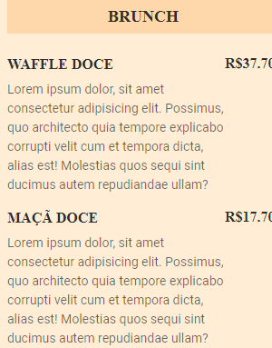

# Maratona Explorer3

Projeto construído no Evento Next Level Week (NLW) da Rockseat.

[🔗 Acesse aqui](https://bruna-luc.github.io/Maratona-Explorer3/)

## Objetivos 
  Desenvlver o site com o cardápio de um café

## 📚 Tecnologias 
- HTML
- CSS

## Conceitos/conhecimentos utilizados no projeto.

* HTML
  - Utilizado tag básicas 

* CSS
   - Básico 

## 😁 Contato
bruna.o.fonseca@hotmail.com